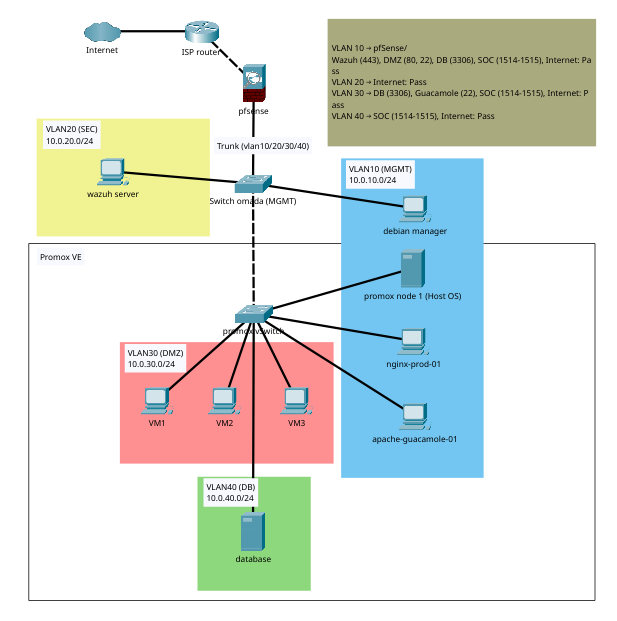

# Multi-layered SOC & Virtualization Architecture

## 🚧 Project Status

> ⚠️ This project is currently in progress. Documentation may be incomplete or subject to change.

## Tổng quan
Dự án tập trung xây dựng hạ tầng kỹ thuật cho một mô hình SOC quy mô nhỏ, phục vụ mục đích học tập và thực nghiệm. Phạm vi hiện tại chủ yếu xoay quanh phần công nghệ (Technology), chưa bao gồm đầy đủ quy trình vận hành (Process) và nhân sự SOC (People).

Hệ thống được triển khai theo hướng phân tách mạng, giám sát tập trung và kiểm soát truy cập bằng định danh. Các thành phần chính gồm:
- pfSense làm gateway và phân vùng mạng
- Snort giám sát lưu lượng mạng
- Wazuh thu thập và phân tích log tập trung
- Nginx + Authelia làm lớp xác thực cho khu vực quản trị

Mục tiêu của dự án là:
- Hiểu cách xây dựng một kiến trúc giám sát an ninh cơ bản
- Thực nghiệm các kịch bản tấn công phổ biến
- Quan sát cách hệ thống phát hiện và ghi nhận sự kiện an ninh
- Làm quen với việc triển khai SIEM/NIDS trong môi trường thực tế nhỏ

## Kiến trúc hệ thống
- Hypervisor: Proxmox VE (VM & LXC)
- Phân vùng mạng:
  - Management Zone
  - Security Zone
  - DMZ
  - Database Zone
- Firewall/Gateway:
  - pfSense
  - VLAN trunking
  - NAT
  - DHCP/DNS
- Reverse Proxy & Authentication:
  - Nginx
  - Authelia (MFA)

## Hệ thống bảo mật
- IDS/NIDS: Snort (triển khai tại gateway pfSense)
- SIEM/HIDS: Wazuh Server
- Endpoint Monitoring:
  - Wazuh Agent trên các máy ảo
  - Thu thập:
    - auth.log
    - syslog
    - nginx access/error log
    - snort alert log

## Tính năng chính
- Phân tách mạng bằng VLAN để cô lập dịch vụ
- Giới hạn kết nối giữa các vùng mạng theo nguyên tắc least privilege
- Reverse Proxy kết hợp MFA cho khu vực quản trị
- Thu thập và phân tích log tập trung bằng Wazuh
- Giám sát lưu lượng mạng bằng Snort
- Thực nghiệm một số kịch bản:
  - Nmap aggressive scan
  - Stealth/fragmented scan
  - SSH/API brute-force
  - File Integrity Monitoring (FIM)

## Ứng dụng
- Làm môi trường học tập và nghiên cứu ATTT
- Quan sát log và cảnh báo từ nhiều nguồn khác nhau
- Thực hành triển khai SIEM/NIDS trong homelab
- Hiểu cách các lớp giám sát phối hợp với nhau
- Thử nghiệm các cấu hình mạng và kiểm soát truy cập cơ bản

## Tài liệu
Xem chi tiết tại: [https://github.com/vamamurin/tapama-system/blob/main/Xay_dung_he_thong_SOC.pdf]

## 👥 Team Members
- Nguyen Duc Manh
- Luong Minh Tan
- Trinh Vo Tan Phat
