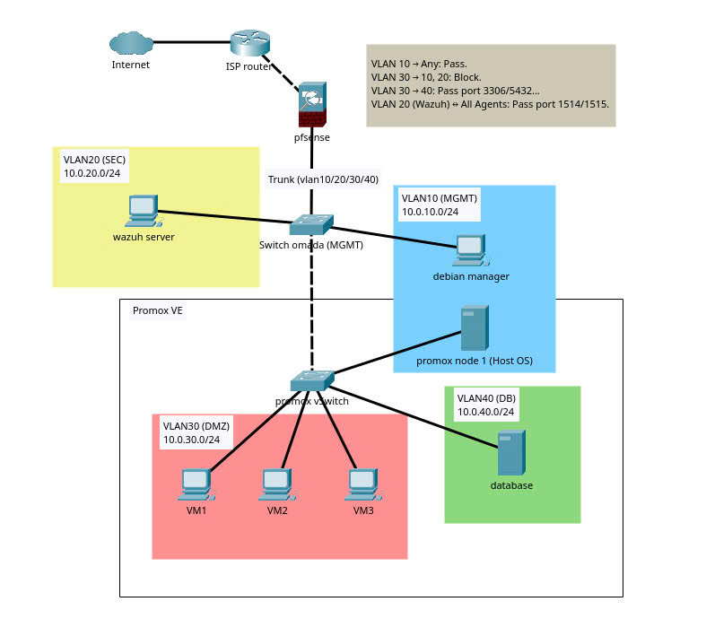

# Multi-layered SOC & Virtualization Architecture

## Tổng quan
Dự án mô phỏng một môi trường SOC (Security Operations Center) quy mô nhỏ sử dụng ảo hóa và phân vùng mạng. Mục tiêu là minh họa cách giám sát và phát hiện tấn công trên nhiều lớp trong một hệ thống thực tế.

## Kiến trúc hệ thống
- Hypervisor: Proxmox VE (VM & LXC)
- Phân vùng mạng:
  - LAN
  - DMZ
  - Database Zone
  - Management Zone
- Firewall: pfSense (DHCP, DNS, NAT, VLAN trunking)

## Hệ thống bảo mật
- IDS: Snort (triển khai tại gateway)
- SIEM: Wazuh Server
- Giám sát endpoint: Wazuh Agent trên các máy ảo

## Tính năng chính
- Phân tách mạng bằng VLAN để cô lập các vùng quan trọng
- Áp dụng mô hình defense-in-depth (nhiều lớp bảo vệ)
- Thu thập và phân tích log tập trung qua SIEM
- Phát hiện các tấn công mô phỏng:
  - Quét mạng (Nmap)
  - SSH brute-force

## Ứng dụng
- Phân tích log và cảnh báo
- Mô phỏng quy trình phát hiện sự cố (SOC workflow)
- Hiểu cách hoạt động của hệ thống giám sát an ninh
- 
## Tài liệu
Xem chi tiết tại: [PDF Link]

